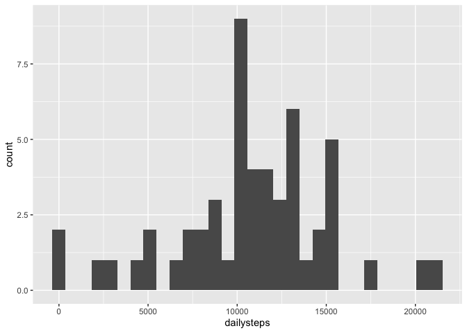
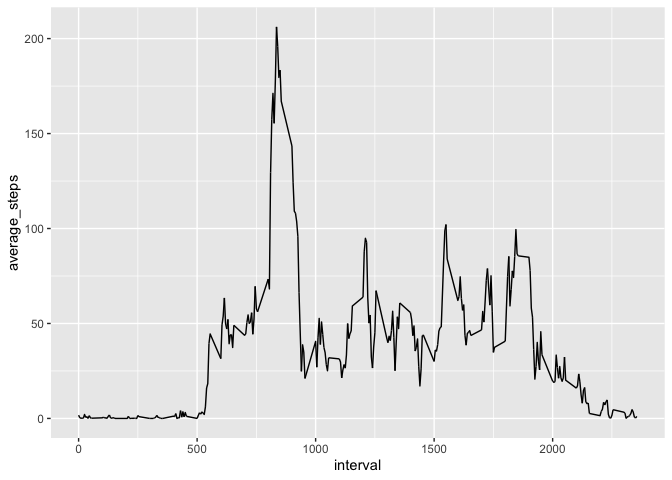
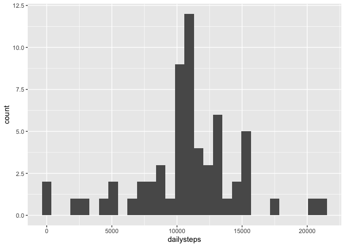
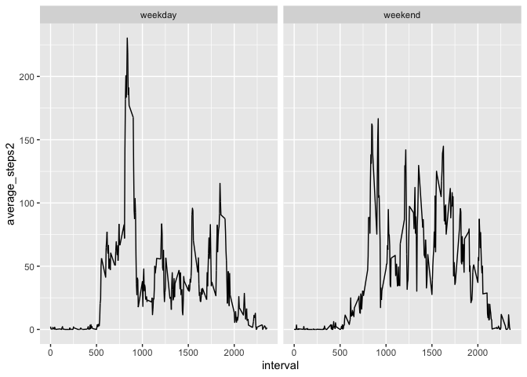

## Loading and preprocessing the data

```r
library(tidyverse)
```

```
## ── Attaching packages ─────────────────────────────────────────────────────────── tidyverse 1.3.0 ──
```

```
## ✓ ggplot2 3.3.1     ✓ purrr   0.3.4
## ✓ tibble  3.0.1     ✓ dplyr   1.0.0
## ✓ tidyr   1.1.0     ✓ stringr 1.4.0
## ✓ readr   1.3.1     ✓ forcats 0.5.0
```

```
## ── Conflicts ────────────────────────────────────────────────────────────── tidyverse_conflicts() ──
## x dplyr::filter() masks stats::filter()
## x dplyr::lag()    masks stats::lag()
```

```r
library(ggplot2)
library(stringr)

url<-"https://d396qusza40orc.cloudfront.net/repdata%2Fdata%2Factivity.zip"
destfile<-paste(getwd(),"exdata_data_NEI_data.zip",sep="/") 
download.file(url, destfile)
unzip(destfile)
data<-read.csv("activity.csv")
```


## What is mean total number of steps taken per day?
This code creates a histogram plot of the total number of steps taken each day:

```r
sum<-data %>% group_by(date) %>% summarise(dailysteps = sum(steps))
ggplot(sum, aes(dailysteps)) + geom_histogram()
```

<!-- -->

The code below provides the mean and median of steps each day


```r
mean<-mean(sum$dailysteps, na.rm = TRUE)
median<-median(sum$dailysteps,na.rm=TRUE)
```
                
The mean number of steps is 1.0766189\times 10^{4} and the median is 10765

## What is the average daily activity pattern?


```r
data <-data %>% group_by(interval) %>% 
  mutate(average_steps = mean(steps, na.rm = TRUE))

ggplot(data, aes(interval, average_steps)) + geom_line()
```

<!-- -->


## Imputing missing values

Which 5-minute interval, average across all the days in the dataset, 
contains the maximum number of steps?


```r
max_interval<-data[which.max(data$average_steps),3]
```
The interval with the maximum number of steps is 835

Imputing missing values: 

1. Calculate and report the total number of missing values in the dataset 
(i.e. the total number of rows with NAs)

```r
missing_rows<-nrow(data %>% filter(is.na(steps)))
```
The number of rows with missing data is 2304

In the following section, I replaced missing values with the average for 
that specific interval across all other days. 


```r
test <- function(x, y, z) {
  if(is.na(x)==TRUE) y else z
}

data$finalsteps <- mapply(test, data$steps, data$average_steps, data$steps)
```

This is the plot of daily steps using imputted values

```r
sum2<-data %>% group_by(date) %>% summarise(dailysteps = sum(finalsteps))
ggplot(sum2, aes(dailysteps)) + geom_histogram()
```

<!-- -->

```r
mean<-mean(sum2$dailysteps, na.rm = TRUE)
median<-median(sum2$dailysteps,na.rm=TRUE)
```
                
Using the dataset with imputed data, the mean number of steps is 1.0766189\times 10^{4} and the median is 1.0766189\times 10^{4}


## Are there differences in activity patterns between weekdays and weekends?
Are there differences in activity patterns between weekdays and weekends?


```r
data$dayoweek<-weekdays(as.Date(data$date))
data<-data %>% mutate(dayoweek = ifelse(dayoweek == "Saturday" | dayoweek == "Sunday", "weekend", "weekday"))

data <-data %>% group_by(dayoweek, interval) %>% 
  mutate(average_steps2 = mean(finalsteps, na.rm = TRUE))

data %>% group_by(dayoweek) %>% summarise(mean = mean(average_steps2))
```

```
## # A tibble: 2 x 2
##   dayoweek  mean
##   <chr>    <dbl>
## 1 weekday   35.6
## 2 weekend   42.4
```

```r
ggplot(data, aes(x=interval, y=average_steps2)) + geom_line() + facet_wrap(~dayoweek)
```

<!-- -->


  


